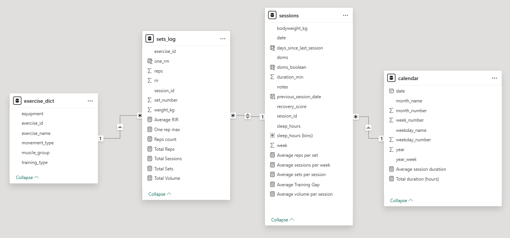
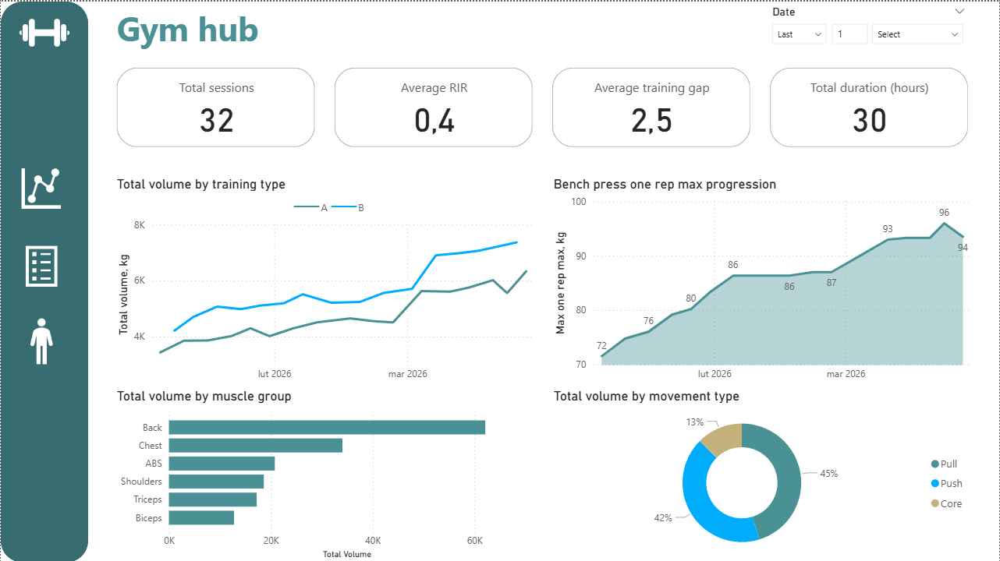
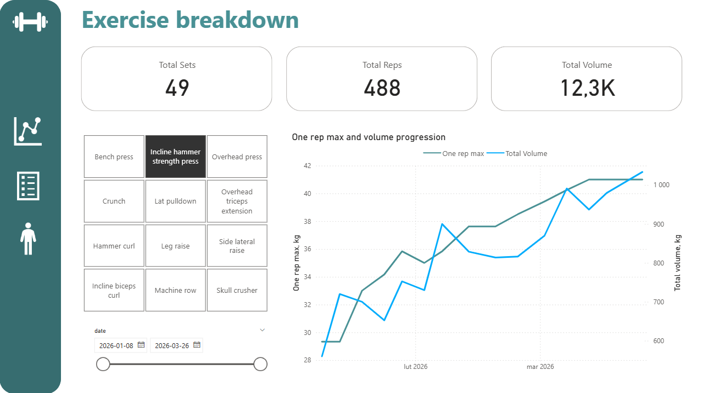
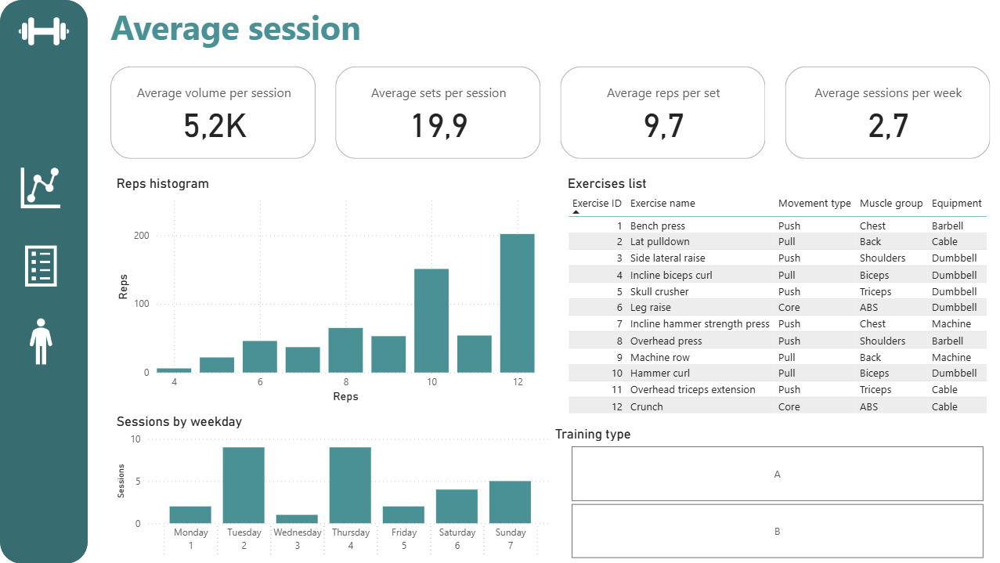
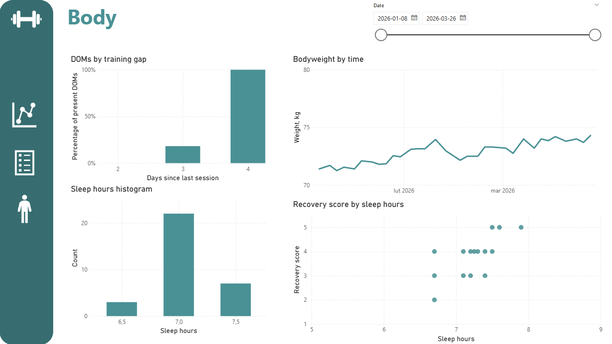

# Strength Training Analytics Dashboard

## 📌 Project Overview

This project analyzes personal strength training data to evaluate workout effectiveness, progression, and recovery. Data is collected in Google Sheets and transformed into an analytical model in Power BI.

The goal was not only to track workouts, but to **build a structured analytics solution** that answers performance-related questions using real data.


## 🎯 Analytical Goal

**Main Question:**  
Is my workout actually effective in improving strength, consistency, and overall performance?


## ❓ Key Questions

### 📊 General Performance
- Is training volume increasing over time (by training type)?
- Am I getting stronger in key lifts (e.g. bench press)?
- Is my training balanced across movement types and muscle groups?

### 💪 Intensity & Consistency
- Am I training hard enough (based on RIR)?
- Am I consistent (sessions per week, training gap)?

### 🏋️ Exercise-Level Analysis
- Is volume and estimated 1RM improving for individual exercises?

### 📈 Training Structure
- What does a typical session look like?
  - volume per session  
  - sets per session  
  - reps per set  
  - sessions per week  
- What is the distribution of rep ranges?
- On which days do I train most often?

### 🧠 Recovery & Body Impact
- Does training gap affect DOMS?
- How much do I sleep and how does it affect recovery?
- How does bodyweight change over time?


## 🗄️ Data Source & Architecture

**Data source:** Google Sheets (manual tracking of workouts)    

**Granularity:**
  - session-level (workout metadata, recovery)
  - set-level (exercise performance)

The data is loaded directly into Power BI and transformed using Power Query and DAX.


## 🧱 Data Model

The model follows a **hybrid star schema design**:

### Fact Tables
- **sessions** → session-level data (date, duration, recovery, sleep, bodyweight)
- **sets_log** → set-level data (exercise, reps, weight, RIR, volume)

### Dimension Tables
- **exercise_dict** → exercise metadata (muscle group, movement type)
- **calendar** → date dimension for time analysis

### Relationships
exercise_dict → sets_log  ⟷ sessions ← calendar




## 📐 Metrics & Definitions

Key metrics used in the analysis:

- **Volume** = total reps x weight  
    ```DAX 
    Total Volume = SUMX(sets_log, sets_log[reps]*sets_log[weight_kg])
    Average volume per session = DIVIDE([Total Volume],[Total Sessions])
    ```
- **Sessions** = total sessions
    ```DAX
    Total Sessions = DISTINCTCOUNT(sessions[session_id])
    Average sessions per week = AVERAGEX(VALUES('calendar'[year_week]),CALCULATE(DISTINCTCOUNT(sessions[session_id])))
    ```
- **Sets** = total sets
    ```DAX
    Total Sets = COUNTROWS(sets_log)
    Average sets per session = DIVIDE([Total Sets],[Total Sessions])
    ```
- **Reps** = total reps, count reps
    ```DAX
    Total Reps = SUM(sets_log[reps])
    Reps count = COUNT(sets_log[reps])
    Average reps per set = DIVIDE([Total Reps],[Total Sets])
    ```
- **One rep max** = calculated column for one rep max, one rep max score
    ```DAX
    one_rm = sets_log[weight_kg]*(1+(sets_log[reps]+sets_log[rir])/30)
    One rep max = MAX(sets_log[one_rm])
    ```
- **RIR** = reps in reserve, intensity indicator
    ```DAX
    Average RIR = AVERAGE(sets_log[rir])
    ``` 
- **Training gap** = rest days
    ```DAX
    Average Training Gap = AVERAGE(sessions[days_since_last_session])
    ```
- **Session duration**
    ```DAX
    Total duration (hours) = SUM(sessions[duration_min])/60
    Average session duration = AVERAGE(sessions[duration_min])
    ```

These metrics allow combining:
- performance (strength, volume)
- behavior (consistency)
- recovery (sleep, DOMS)


## 📊 Analysis & Insights

### 🟩 Overall Performance
- Training volume is consistently increasing across both training types  
- RIR indicates high training intensity (close to failure)
- Bench press progression is slowing → possible plateau  

### 🟦 Exercise-Level Insights
- Strong progression in:
  - incline hammer strength press  
  - biceps exercises  
- Moderate / slowing progression in:
  - overhead press  
  - lateral raises  
- Back exercises show variability but positive trend  

### 🟨 Training Structure
- Average session:
  - ~5000 kg volume  
  - ~20 sets  
  - ~9.7 reps per set  
  - ~2.7 sessions per week  
- Most frequent training days: **Tuesday and Thursday**  
- Rep distribution concentrated around **10–12 reps**

### 🟥 Recovery & Body
- 4-day training gaps consistently lead to DOMS → should be avoided  
- Average sleep: ~7 hours  
- More sleep correlates with better recovery score  
- Bodyweight is increasing, but slower than expected for bulking  

### 🟪 Training Balance
- Proper distribution between push and pull movements  
- Highest volume allocated to major muscle groups (chest, back)  
- Smaller groups (arms, shoulders) proportionally lower → expected structure  

## 📊 Dashboard & Deliverables

The Power BI dashboard is structured into multiple analytical views:

- **Overview** → key KPIs and trends  
- **Exercise Breakdown** → strength and volume progression per exercise  
- **Training Structure** → average session characteristics  
- **Recovery & Body** → sleep, DOMS, and bodyweight analysis  

The dashboard allows dynamic filtering by:
- date range  
- training type  
- exercise  

## 📸 Dashboard Preview






## 🎥 Dashboard Operation
[](https://youtu.be/qMJdvhZU6sk)


## 🛠️ Tech Stack

- **Google Sheets** → data collection and validation
- **Power BI** → data modeling & visualization  
- **Power Query** → data transformation  
- **DAX** → metric calculations  

## 🧠 What I Learned

- Designing a **multi-granularity data model** (session vs set level)  
- Building **meaningful metrics**, not just aggregations  
- Applying **time-based analysis** using a calendar table  
- Translating real-world problems into **analytical questions**  
- Improving dashboard usability through **clear structure and navigation**